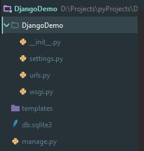

## 安装Django
* 前提：已经装了Python
  ```
  $ python
  Python 3.6.3 (v3.6.3:2c5fed8, Oct  3 2017, 18:11:49) [MSC v.1900 64 bit (AMD64)] on win32
  Type "help", "copyright", "credits" or "license" for more information.
  >>> exit()
  ```
* 安装方式一：执行命令
  ```
  /// 当前最新的稳定版本下载
  $ pip install Django==2.0.5
  ```
* 安装方式二：PyCharm IDE new Django Project 时自动安装
  
* 安装方式三：【全手动】github clone并扔到Python安装目录下的`Lib`目录中
  ```
  $ git clone https://github.com/django/django.git
  ```
* 查看Django版本
  ```
  $ python -m django --version
  ```

## 创建Django项目
#### 创建方式
- 方式一：执行命令
  ```
  $ django-admin startproject mysite
  ```
- 方式二：IDE直接gen（看上图）

#### 初始项目结构
  
* 根目录`DjangoDemo`文件夹名字你随便改无所谓，但是下一级的`DjangoDemo`文件夹则可能有内部资源被外界调用，所以就不能乱改了。
* `__init__.py`：空文件，就是告诉别人我是一个py包
* `settings.py`：Django 配置文件
* `urls.py`：Django项目的URL声明，相当于你的网站的“目录"
* `wsgi.py`：作为你的项目的运行在 WSGI 兼容的Web服务器上的入口

## 启动项目
执行命令：
  ```
  $ python mange.py runserver [端口号，默认8000]
  ```
然后我们看到了log，然后我们去跑`http://localhost:8000/`，然后就有了Django首页界面

- **原理：** 这个命令，启动的是Django自带的DevServer，他是一个纯Python写的轻量级服务器。
- **特点：** 这个devServer它很厉害，在每次被请求的时候，都会去重新加载一遍Python代码【事件驱动的热部署】.

> Django项目特点：在 Django 中，每一个应用都是一个 Python 包，并且遵循着相同的约定。Django 自带一个工具，可以帮你生成应用的基础目录结构，这样你就能专心写代码，而不是创建目录了。


## 参考文章
[Django官方文档](https://docs.djangoproject.com/zh-hans/2.0/intro/tutorial01/)
